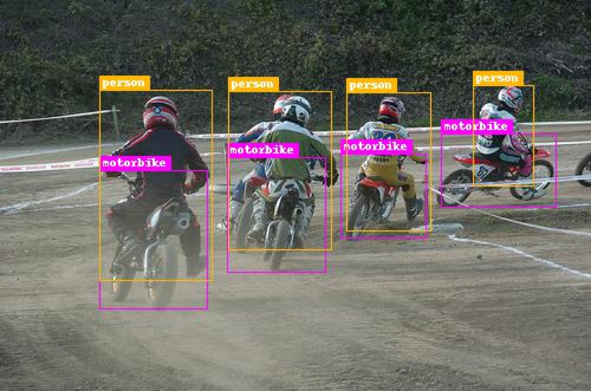
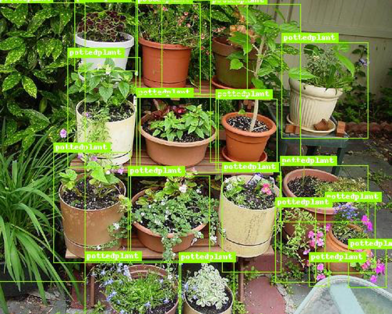
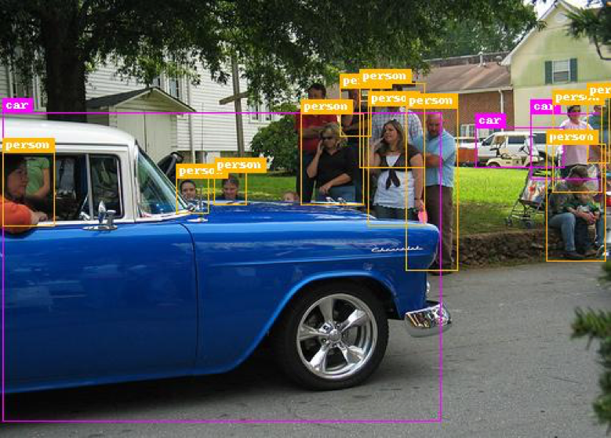

# BEPA.SSD.pytorch
 **B**est **E**ver **P**ractical **A**rchitecture of Single shot object detector.

### About the repo

One-stage detectors are not competitive enough when compared with two-stage detectors. However, there exists methods/tricks to improve them at the leaderboard:

1. Network structure
2. Loss function 
3. Backbone
4. Post-process
5. Multi-scale inference

We plan to release codes of methods that based on the above five points recently. And I believe that they are really helpful for further researching one-stage detectors. 

--------

Some example demo images, the results are generated by BEPA.SSD.

